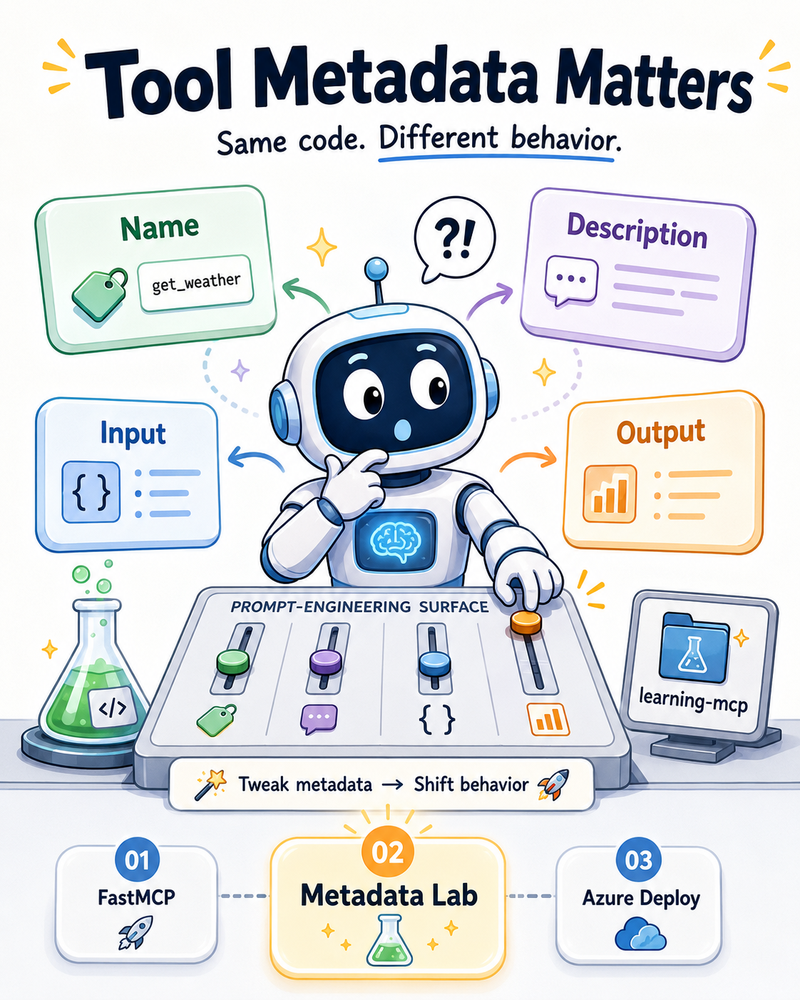

𝗧𝗼𝗼𝗹 𝗺𝗲𝘁𝗮𝗱𝗮𝘁𝗮 𝗶𝘀 𝗮 𝗽𝗿𝗼𝗺𝗽𝘁𝗻𝗴𝗶𝗻𝗲𝗲𝗿𝗶𝗻𝗴 𝘀𝘂𝗿𝗳𝗮𝗰𝗲.

Four pillars control whether an LLM picks your tool, calls it correctly, and interprets the result — name, description, input schema, output schema. Change any one of them. Code stays identical. LLM behavior shifts.

That insight is the core of 𝗹𝗲𝗮𝗿𝗻𝗶𝗻𝗴-𝗺𝗰𝗽 — a kitchen-sink repo I built to experiment with exactly this. Not a polished demo. A working lab: make a change, observe the consequence, understand why.

Two supporting chapters wrap the core:

01 — working FastMCP server, MCP Inspector validation, Streamable HTTP configured correctly.
03 — Azure Functions deployment with dual auth (EasyAuth + system key) and an Entra ID roadmap for production.

But 02 is the reason the repo exists.

Repo (public): github.com/Your-AI-Coworkers/learning-mcp-post